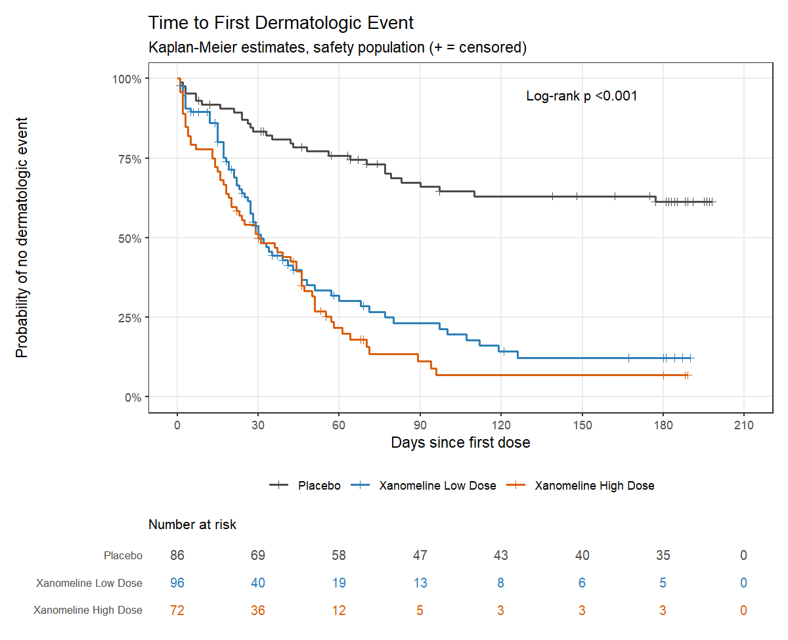

# CDISC Clinical Trial Pipeline: SDTM → ADaM → TFLs

Statistical programming for the CDISC pilot study (CDISCPILOT01: xanomeline transdermal patch in mild to moderate Alzheimer's disease). ADaM datasets and outputs are programmed in **R** and independently in **SAS**, then compared, the way double programming is done in pharma/CRO statistical programming teams.

## What's in here

| Step | Dataset / output | R | SAS | QC |
|---|---|---|---|---|
| 1 | ADSL – subject-level dataset | ✅ | ✅ | ✅ |
| 2 | ADAE – adverse events | ✅ | ✅ | ✅ |
| 3 | ADTTE – time to first dermatologic event | ✅ | ✅ | ✅ |
| 4 | Table 14.1.1 – demographics | ✅ | ✅ | – |
| 5 | Table 14.3.1 – TEAEs by SOC / PT | ✅ | ✅ | – |
| 6 | Figure 14.2.1 – Kaplan–Meier plot | ✅ | ✅ | – |

Derivation rules and the data issues found along the way are in [docs/adam_specs.md](docs/adam_specs.md).

## Key results



- 254 subjects in the safety population (Placebo 86, Low Dose 96, High Dose 72). 12 subjects randomised to High Dose received Low Dose, so safety outputs use actual treatment.
- 85% of subjects had at least one treatment-emergent AE (Placebo 76%, Low Dose 88%, High Dose 94%). Application site pruritus and erythema were the most common.
- Dermatologic events were much more frequent on xanomeline: median time to first event was about 30 days on both doses and not reached on placebo (log-rank p < 0.001). Hazard ratios vs placebo: 4.05 (95% CI 2.60–6.30) for Low Dose and 5.18 (3.30–8.14) for High Dose. No evidence against proportional hazards (Schoenfeld test p = 0.54).

Full outputs: [demographics](output/t_demog.txt) · [adverse events](output/t_ae.txt) · [KM statistics](output/f_km_stats.txt)

## Data

Public CDISC pilot SDTM data from the [pharmaversesdtm](https://pharmaverse.github.io/pharmaversesdtm/) R package (DM, EX, DS, AE, VS). `00_export_sdtm.R` writes them to SAS transport files so both languages start from identical inputs. No confidential data is used.

## How to run

**R** (R ≥ 4.1)

```r
install.packages(c("admiral", "pharmaversesdtm", "dplyr", "tidyr", "stringr",
                   "haven", "survival", "ggplot2", "patchwork", "scales", "diffdf"))
source("run_all.R")
```

Open `cdisc-clinical-trial-pipeline.Rproj` first so paths resolve from the project root.

**SAS** (written for SAS OnDemand for Academics)

1. Upload the project folder to your SAS home directory and set `root` in `programs/SAS/00_setup.sas`
2. Run in order: `00_setup.sas` → `adsl.sas` → `adae.sas` → `adtte.sas` → `qc_compare.sas` → `t_demog.sas` → `t_ae.sas` → `f_km.sas`

**QC**

- `qc_compare.sas` runs PROC COMPARE of each SAS dataset against the R version → `qc/qc_compare_sas.pdf`
- `qc_compare.R` does the same comparison from the R side with `diffdf` → `qc/qc_compare_r.txt`
- Results are logged in [qc/qc_log.md](qc/qc_log.md)

## Repository structure

```
data/sdtm/        input SDTM (.xpt)
data/adam/        ADaM from R (.rds, .xpt)
data/adam/sas/    ADaM from SAS (.xpt)
programs/R/       R programs (admiral, dplyr, survival, ggplot2)
programs/SAS/     SAS programs (DATA step, PROC SQL, PROC REPORT, PROC LIFETEST, PROC PHREG)
qc/               comparison reports and QC log
output/           tables and figures
docs/             ADaM specifications
```

## Author

Basil E · [LinkedIn](https://www.linkedin.com/in/basil-e-biostat) · [GitHub](https://github.com/Basil-stats)
